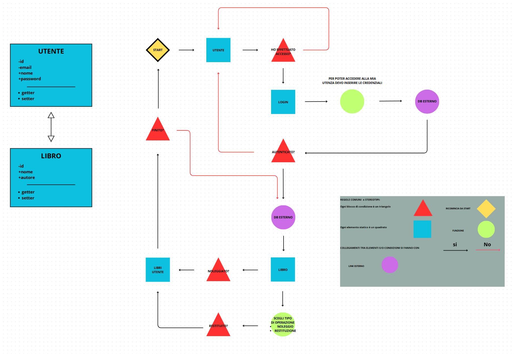
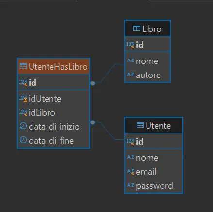

# ASTROlibrary 📚

Benvenuti in ASTROlibrary, piattaforma progettata per il noleggio e lo scambio di libri.

Siamo entusiasti di presentarti il nostro nuovo software che rende il noleggio e la restituzione dei libri semplice e conveniente. Con questa innovativa piattaforma, potrai accedere a una vasta selezione di titoli, esplorare nuove letture e gestire i tuoi prestiti in modo facile e intuitivo.

---

## **🔗 UML**

La prima parte del nostro progetto ci ha visto impegnati nella stesura di un DIAGRAMMA DI SEQUENZA che andasse a descrivere il funzionamento della nostra applicazione.



Prima di creare il diagramma UML e andare a sviluppare il nostro progetto ci siamo dovuti soffermare sui *REQUISITI FUNZIONALI* dell’applicativo.

### 🔧 REQUISITI FUNZIONALI:

- Registrazione/Login degli utenti
- Ricerca e noleggio dei libri
- Gestione dei prestiti e restituzione dei libri

> *By AndreaL*
> 

## 🗄️ DATABASE

Abbiamo creato il modello E/R e la struttura del nostro database utilizzando ***DBeaver 🦫*** andando a creare poi le classi corrispondenti al suo interno e sviluppando quelli che sono gli attributi e parametri fondamentali.

### Libro

id —> PRIMARY KEY

### Utente

id —> PRIMARY KEY

### UtenteHasLibro

id —> PRIMARY KEY

---

idLibro —> FOREIGN KEY

idUtente —> FOREIGN KEY

---



> *By GiovanniF*
> 

## 👾 JAVA SPRING

### AUTENTICAZIONE 🔐

Dopo aver inserito alcuni oggetti di tipo utente all’interno del database abbiamo testato la funzionalità di Login e di Registrazione all’interno del database, solo una volta che l’utente viene loggato potrà occuparsi poi della gestione e il noleggio dei libri.

---

### CONTROLLER - SERVICE - REPOSITORY 🗂

Nel Controller abbiamo settato come API principale mediante l’annotation @GetMapping la nostra home_page.

```jsx
//Annotation che ci mappa il main facendoci visualizzare la lista degli utenti
@RequestMapping('api/v1/utenti')
//Annotation che ci mappa il main facendoci visualizzare la lista dei libri
@RequestMapping('api/v1/libri')
```

Creiamo e gestiamo una sessione di login per poter gestire poi il modo in cui vengono noleggiati i libri — noleggia() — 

Mediante le opzioni di CRUD riusciamo a gestire tutte le operazioni di inserimento e modifica delle tabelle all’interno delle tabelle salvate su DBeaver.

---

### MODEL ⚙️

Nel Model creiamo le due entità del libro e dell’utente con i parametri definiti precedentemente dall’UML e successivamente con i valori pre-impostati all’interno del nostro database.

> By IvanP & AlessandroS
> 

> *Documentation By AndreaL*
>